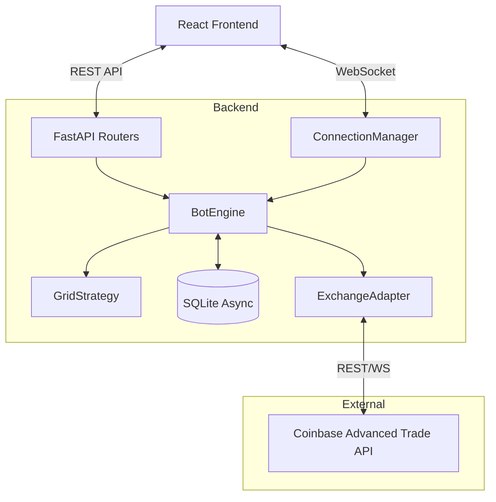

# System Architecture

## Overview
The Coinbase Gridbot is a high-performance automated trading system designed for reliability and safety. It uses a **FastAPI** backend for order orchestration and state management, coupled with a **React** frontend for real-time monitoring and control.

## Component Diagram

## Core Components

### 1. Bot Engine (`backend/app/bot/engine.py`)
The heart of the system. It runs an infinite async loop (`tick()`) that:
1.  Fetches current market prices.
2.  Updates the internal state (`AnchorHigh`).
3.  Calculates required grid levels.
4.  Syncs orders (Places new buys, Prunes old ones).

### 2. Exchange Adapter (`backend/app/exchanges/`)
Abstracts the exchange API.
-   **CoinbaseAdapter**: Handles authentication (HMAC-SHA256), rate limiting, and websocket subscription.
-   **MockAdapter**: Used for development and testing. Simulates fills and price movements.

### 3. Database (`backend/app/db/`)
SQLAlchemy + aiosqlite.
-   **Markets**: Configuration for each trading pair.
-   **Orders**: Tracks every order placed by the bot.
-   **BotState**: Persists critical values like `AnchorHigh` across restarts.

### 4. Frontend (`frontend/`)
React + Vite application.
-   **WebSocket Hook**: `useWebSocket` maintains a live connection for price updates.
-   **BotStatus**: Visual indicator of system health.
-   **OrderManager**: Tabulated view of open orders and inventory.
